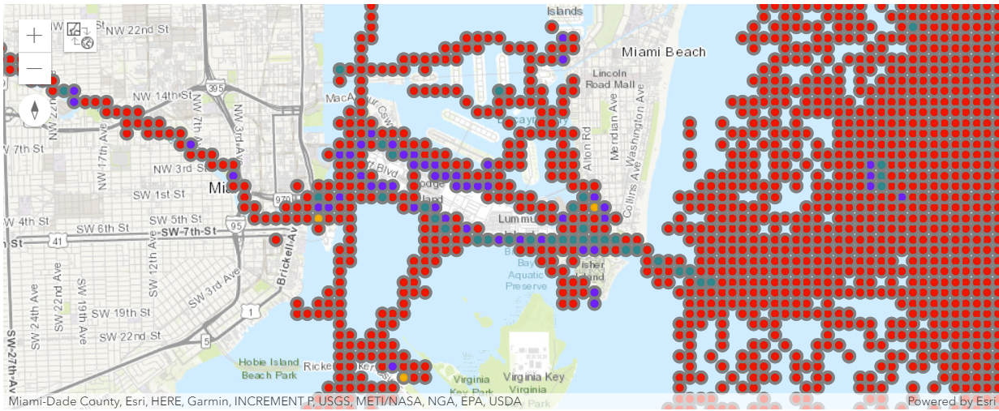

# Jupyer Notebook using ESRI built-in [Spark](https://spark.apache.org/).

This notebook is borrowed from Mansour's github [ESRI Spark notebook](https://github.com/mraad/spark-esri)  to demonstrate the spatial binning of AIS data around the port of Miami using Apache Spark. Mansour's notebook create the spatila bining inside ArcGIS Pro. What I tried is to use notebook outside ArcGIS Pro.  

The AIS broadcast data is in a FileGeodatabase that can be download from [here](https://marinecadastre.gov/ais). 

I download one month of data for test. It is quickly out of memoery as it has over 10 milion points just for a month data. I clipped to one milion points of data closed to the port. The spark SQL runs well.

Create a new conda environment and activate it to use this notebook, as follows:

- Start a `Python Command Prompt` from `Start > ArcGIS`.

- Execute the following:

```
conda create --yes --name spark_esri --clone arcgispro-py3
activate spark_esri
pip install pyarrow
```
[Spatial Binning](sparkesri_MiamiAIS.ipynb) Notebook


